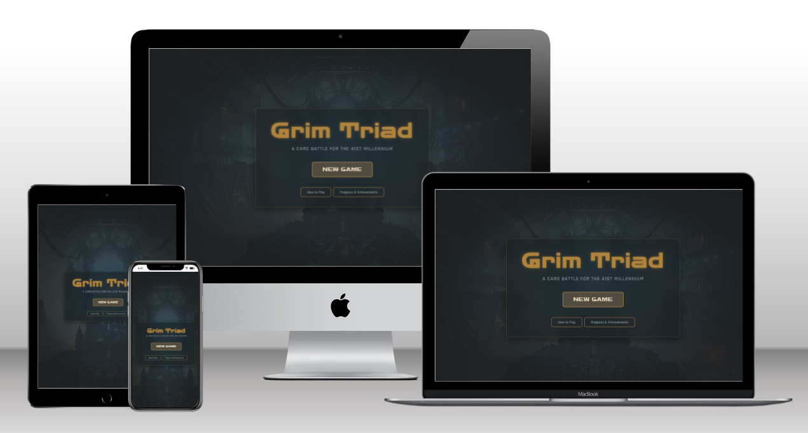
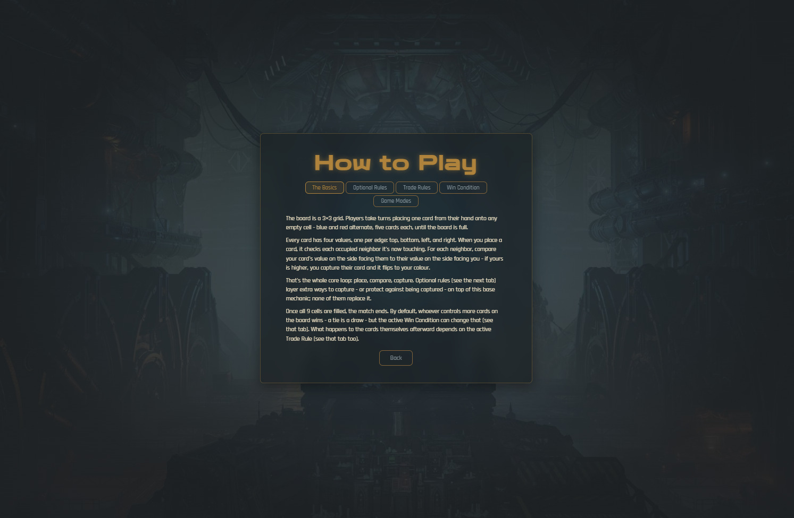
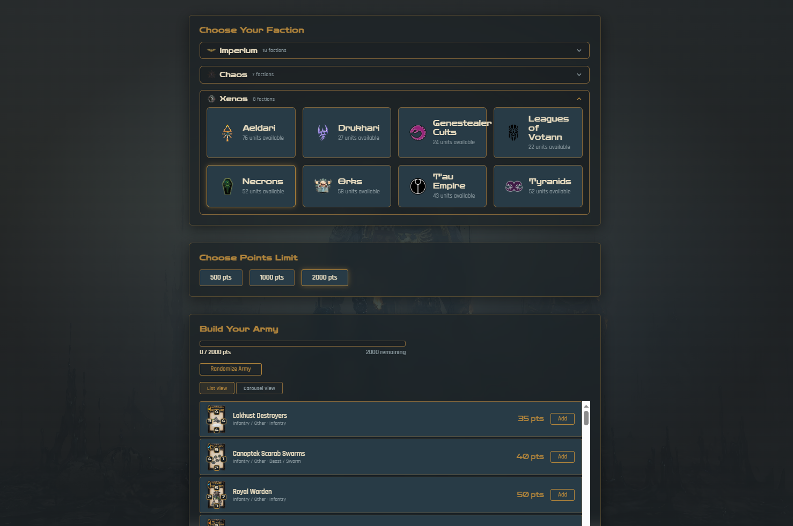
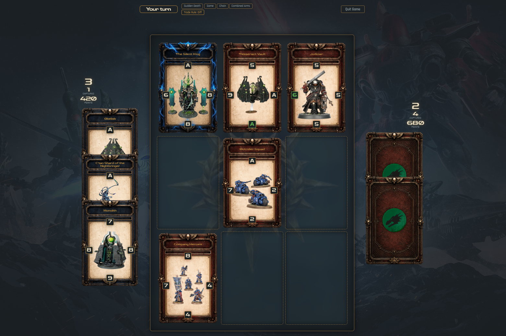
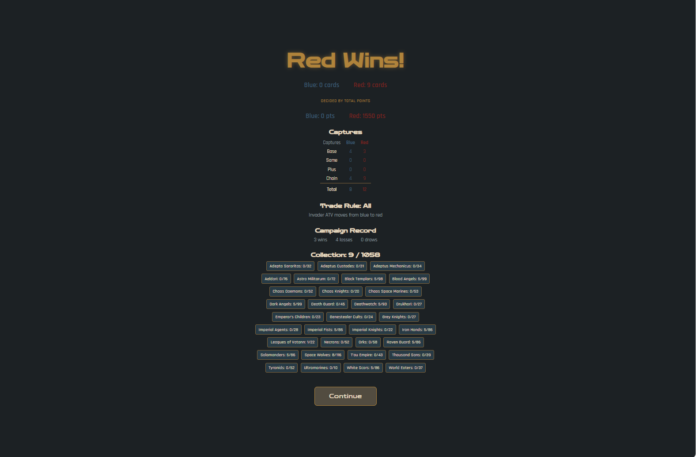
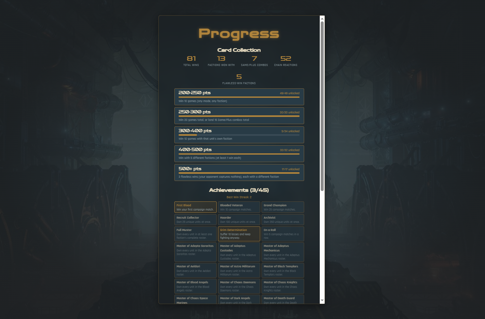
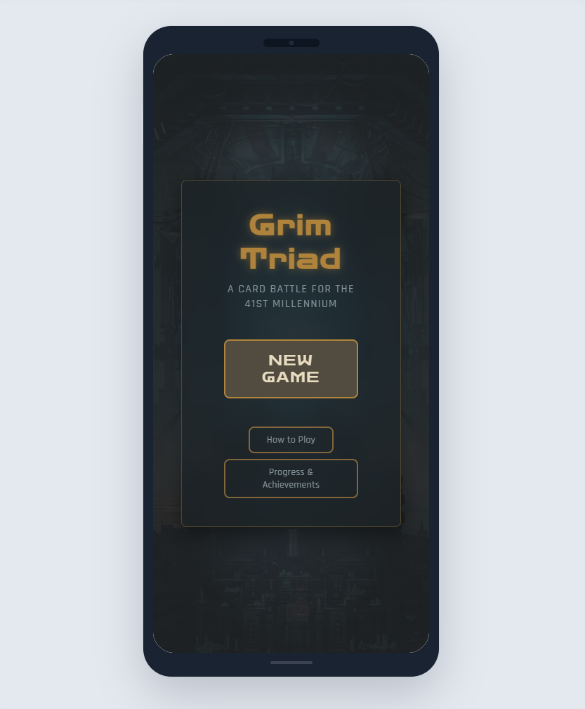

<div align="center">

<!-- PLACEHOLDER: swap for a real logo/wordmark once you have one -->


# Grim Triad

**Build your army. Take the board. Own the battlefield.**

A Warhammer 40,000–themed card battler in the style of *Triple Triad* — draft a points-capped army from a real 40k faction, then battle for board control on a 3×3 grid using directional capture, a full suite of optional modifier rules, and a Trade Rule that decides what you actually walk away with.

[](https://TGOSS1984.github.io/grim-triad/)

[]()
[]()
[]()
[]()
[]()
[]()

[]()
[]()
[]()

</div>



---

> **This is an unofficial fan project.** Grim Triad is a non-commercial hobby build. It is **not** affiliated with, endorsed by, or sponsored by Games Workshop Limited or Square Enix. Warhammer 40,000, all faction names, unit names, and associated marks are the property of Games Workshop. Triple Triad is a minigame from *Final Fantasy VIII*, developed by Square (now Square Enix). See [Credits & Acknowledgements](#-credits--acknowledgements) for full attribution.

---

## 📚 Table of Contents

- [📸 Screenshots](#-screenshots)
- [📖 Project Overview](#-project-overview)
- [🎯 What Grim Triad Offers](#-what-grim-triad-offers)
- [🎨 Design & UI Philosophy](#-design--ui-philosophy)
- [🚀 Key Features](#-key-features)
- [🏗️ Tech Stack](#️-tech-stack)
- [🧠 Architecture Overview](#-architecture-overview)
- [📂 Project Structure](#-project-structure)
- [⚙️ Local Setup & Installation](#️-local-setup--installation)
- [🧪 Testing](#-testing)
- [🐛 Bugs Encountered & Solutions](#-bugs-encountered--solutions)
- [✅ Manual Testing](#-manual-testing)
- [🚀 Deployment](#-deployment)
- [🗂️ Project Management](#️-project-management)
- [📌 Future Enhancements](#-future-enhancements)
- [🙏 Credits & Acknowledgements](#-credits--acknowledgements)
- [📬 Contact](#-contact)

---

## 📸 Screenshots

> A collection of images from the live site

### 🏠 Home


> *Landing screen — New Game, Progress & Achievements, How to Play*

---

### 🛡️ Faction & Army Builder


> *Accordion faction select (Imperium / Chaos / Xenos), points-capped roster building, list and carousel browsing views*

---

### ⚔️ Battle


> *The 3×3 grid mid-match, with a SAME! rule trigger callout and active rule chips*

---

### 🏆 Campaign Home


> *Persistent collection size, win/loss record, streaks, and rival status*

---

### 📊 Progress & Achievements


> *Card unlock tiers with live progress bars, alongside the full achievement grid*

---

### 📱 Mobile


> *Responsive layout across breakpoints*

---

## 📖 Project Overview

**Grim Triad** takes the core loop of *Triple Triad* — the beloved card minigame from *Final Fantasy VIII* — and rebuilds it from the ground up around Warhammer 40,000: real factions, real units, real points costs, on a battlefield instead of a card table.

Every one of the 1,075 units in the game's catalogue is sourced from the actual *Warhammer 40,000 10th Edition* Munitorum Field Manual (points values current as of March 2025), imported from a structured spreadsheet and run through a custom stat-generation pipeline that converts a unit's points cost into four directional card values — cheap infantry are fast and fragile, superheavies hit like a truck on at least one side but rarely all four. No stats are hand-authored; they're procedurally derived and reproducible from the source data.

The project is a fully static, client-side React + TypeScript application — no backend, no server, no API calls, no accounts. Progress (your campaign collection, achievements, and card-unlock status) persists entirely in the browser via `localStorage`. It's built to be playable purely from a GitHub Pages URL with nothing to sign up for.

A significant amount of effort went into making the game feel like it has real depth beyond a single match: a **Campaign mode** with a persistent, evolving collection and an AI rival with its own depletable card pool; a **cross-mode card-unlock system** that gates the game's rarest, most powerful units (Titans, superheavy gunships) behind genuine play milestones; and a full **achievement system** — all consolidated into a single Progress screen so there's always a clear answer to "what am I working toward next".

---

## 🎯 What Grim Triad Offers

### For a Quick Match

- **Single Match mode** — build an army, pick your rules (or randomize them), and play one battle start to finish
- **12 optional modifier rules** — Open, Sudden Death, Random, Same, Same Wall, Plus, Elemental, Chain, Heroic, Combined Arms, Underdog, and Epic Hero Presence, each independently toggleable
- **4 Trade Rules** — One, Diff, Direct, and All, deciding what happens to captured cards once the match ends
- **Rule trigger callouts** — a large, colour-coded "SAME!" / "PLUS!" / "CHAIN!" banner flashes above the board the instant one of those rules fires, so a fast multi-card combo is never missed

### For Longer Sessions

- **Series mode** — build a larger army pool and play consecutive rounds, drawing a fresh hand each round with no repeats across the whole series
- **Campaign mode** — build a starting roster, then keep playing across sessions. Wins add cards to your permanent collection, losses take them away, and your roster genuinely evolves match to match
- **A real AI rival** — in Campaign mode specifically, the AI opponent has its own persistent, depletable card pool (not an infinite catalogue). Grind it down far enough and it needs reinforcements to keep fighting — a milestone worth an achievement of its own

### For Progression

- **Card unlocks** — the game's most expensive, most iconic units (up to and including actual Titans) start locked, gated behind cross-mode play milestones — total wins, per-faction wins, landing Same/Plus combos, winning with a spread of different factions, and flawless (zero-capture-against-you) wins
- **Live unlock progress** — a locked card doesn't just say "locked", it shows exactly how close you are: *"6/10 games won"*, updating in real time as you play, in any mode
- **A premium unlock reveal** — crossing a threshold triggers a full-attention reveal of the card(s) you just earned, at the same scale as the game's own card-inspection lightbox
- **Achievements** — a permanent, cross-session trophy case, from *First Blood* to *Rival Vanquished*
- **One consolidated Progress screen** — every tier's unlock status and every achievement, in one place

### For Learning the Game

- **How to Play** — a tabbed in-app reference covering the core capture mechanic, every optional rule, every Trade Rule, and what each game mode offers, without ever needing to leave the app

---

## 🎨 Design & UI Philosophy

Grim Triad leans into a dark, grim-dark aesthetic befitting its theme — muted surfaces, gold accent highlights, and glass-panel UI chrome throughout.

### Design Tokens

- **Accent colour** — warm gold, used consistently for active states, achievement highlights, and glow effects
- **Typography** — [Rajdhani](https://fonts.google.com/specimen/Rajdhani) for body/UI text, [Zen Dots](https://fonts.google.com/specimen/Zen+Dots) for display headings, both self-hosted via Fontsource (no external font CDN request)
- **Glass panels** with `backdrop-filter: blur` for every major screen's content container

### Visual Identity

- **Per-rule visual language** — Same, Plus, and Chain each have their own distinct colour and particle-effect "tell" on the card itself (cyan pulse rings, gold converging sparks, violet jagged bursts), reinforced by the matching large-scale rule trigger banner
- **A decorative board emblem** — a subtle, low-opacity watermark sits behind the 3×3 grid, gradually obscured as cards fill the board over the course of a match rather than competing with the cards themselves
- **Faction grouping by alignment** — the 18 currently-active factions are grouped into an Imperium / Chaos / Xenos accordion, each with a custom abstract icon (deliberately original artwork, not Games Workshop's own iconography)
- **Locked-card treatment** — a locked unit is shown, not hidden: greyscale, padlocked, with its unlock condition as a caption, so the goal is always visible

### UX Decisions

- **No URL routing** — navigation is a `step`-based state machine, not a client-side router. Simpler for a game that's fundamentally linear-with-branches, and it means GitHub Pages deployment has none of the usual SPA-routing quirks to work around
- **Accordion over one long list** — the 18-and-growing faction roster is grouped and collapsible rather than one endless scroll
- **A deliberate end-of-game pause** — the transition from a match's final move to the results screen is intentionally slowed down, so the outcome actually registers before the screen changes
- **Two browsing views everywhere a roster is shown** — a compact list and a large-card carousel, so a locked unit can be seen and admired at full size, not just skimmed past in a list row

---

## 🚀 Key Features

### Faction Select & Army Building

- 18 currently-active factions (of 38 total in the underlying catalogue), grouped by alignment
- Two ways to browse: a dense scrolling list, or a one-card-at-a-time carousel with swipe/keyboard navigation
- Points-capped army building with a live remaining-points tally
- "Randomize Army" — fills out a legal roster automatically, respecting the points cap, army size, and (in Campaign mode) which units are actually unlocked
- Full-size card preview via a Lightbox-style overlay from either browsing view

### Battle

- 3×3 grid, directional capture: place a card, compare its facing value against each occupied neighbour, capture on a win
- Optional rules layer additional ways to capture (or resist capture) on top of the base mechanic — see the in-app How to Play screen for the full rundown of all 12
- Elemental terrain tiles that boost or weaken a card depending on its own element
- A capture flip animation with per-rule-kind visual treatment, staggered across multi-card combo captures so each one is actually visible
- Rule trigger callout banners for Same, Plus, and Chain moments specifically

### Campaign Mode

- A persistent starting roster that evolves match to match — wins add cards, losses remove them
- An AI rival with its own persistent, depletable pool (not the unconstrained full catalogue every other mode's AI draws from), built using the same points-cap and difficulty-tuned roster logic as any other AI opponent
- Reinforcements — once the AI's pool runs low, it can be refilled, keeping a run going rather than ending it outright
- Two campaign-specific milestones, each with its own full-attention celebration: **Collection Complete** (owning one of everything currently obtainable) and **Rival Vanquished** (grinding the AI's pool down to its last few cards)
- A full win/loss/draw record, current and best-ever win streaks

### Card Unlocks & Progression

- Five points-cost tiers (200–250, 250–300, 300–400, 400–500, 500+), each gated behind a different kind of milestone — see the in-app How to Play / Progress screens for exact thresholds
- Progress tracked identically across every game mode — a Single Match win counts exactly as much as a Campaign win
- Live, per-card progress captions that update as you play, computed against whichever unlock path you're actually closest to
- A dev-only global on/off switch for the entire lock system, for local testing (`ENABLE_CARD_UNLOCKS` in `src/state/unlockStore.ts`)

### Progress & Achievements

- One screen combining every unlock tier's status and the full achievement grid
- Achievements span first wins, win totals, win streaks, collector milestones, faction mastery, and both campaign-specific milestones above
- All progression is permanent — it survives starting a new Campaign run

### How to Play

- A tabbed in-app reference: The Basics, Optional Rules, Trade Rules, and Game Modes
- Rule descriptions are pulled from the exact same data the in-match rule picker uses, so the reference screen and the actual game can never describe a rule differently

---

## 🏗️ Tech Stack

| Layer | Choice | Why |
|---|---|---|
| **Framework** | React 18 | Component model fits a screen-by-screen, state-driven game UI well |
| **Language** | TypeScript | The engine's rule interactions (12 optional rules, 4 trade rules, all composable) are exactly the kind of logic that benefits from a real type system catching invalid states at compile time |
| **Build tool** | Vite | Fast dev server, simple static-site production build — no backend to coordinate with |
| **State management** | Zustand | Small, hook-based, no boilerplate — a good fit for several independent-but-related stores (live match, army builder, campaign, series, cross-mode unlocks) rather than one monolithic store |
| **Animation** | Framer Motion | Card flips, rule trigger banners, and modal reveals all need real enter/exit choreography, not just CSS transitions |
| **Schema validation** | Zod | Validates the generated unit/faction JSON against a runtime schema at load time, catching drift between the data pipeline's output and what the engine expects |
| **Data source parsing** | SheetJS (`xlsx`) | Reads the source Warhammer 40k catalogue workbook directly — no manual data entry for 1,000+ units |
| **Testing** | Vitest + React Testing Library | Vite-native test runner, avoids a second build config; RTL for behaviour-focused component tests |
| **Fonts** | Fontsource (Rajdhani, Zen Dots) | Self-hosted Google Fonts — no external font CDN request at runtime |
| **Icons** | react-icons (Game Icons set) | Used sparingly for elemental terrain icons |
| **Hosting** | GitHub Pages, via GitHub Actions | Fully static app, zero backend — a natural fit; deploys automatically on every push to `main` |

No backend, no database, no authentication. All persistence is `localStorage`, scoped per-browser.

---

## 🧠 Architecture Overview

```
data/source/*.xlsx  (real 40k catalogue + points)
        │
        ▼  npm run build:data
┌───────────────────────────────┐
│  scripts/                     │
│  parseCatalogue.ts            │  raw rows → normalized units,
│  statCurve.ts                 │  Space Marine chapter roll-up,
│  build-data.ts                │  points → 4-sided card stats
└───────────────────────────────┘
        │
        ▼  writes
src/data/units.generated.json
src/data/factions.generated.json
        │
        ▼  validated at load time via
src/data/schema.ts  (Zod)
        │
        ▼
┌────────────────────────────────────────────┐
│  src/engine/                                │
│  Pure TypeScript. Zero React/DOM deps.      │
│  board.ts · capture.ts · gameReducer.ts     │
│  ruleEngine.ts · rules/ (12 modifier rules) │
└────────────────────────────────────────────┘
        │  wrapped by
        ▼
┌────────────────────────────────────────────┐
│  src/state/  (Zustand stores)               │
│  gameStore · campaignStore · seriesStore    │
│  armyBuilderStore · unlockStore             │
└────────────────────────────────────────────┘
        │  consumed by
        ▼
┌────────────────────────────────────────────┐
│  src/components/ + src/screens/             │
│  React, CSS Modules, Framer Motion          │
└────────────────────────────────────────────┘
        │  orchestrated by
        ▼
   src/App.tsx  (step-based navigation,
                  no client-side router)
```

### Key Architectural Decisions

**A pure, dependency-free engine layer** — `src/engine/` has zero imports from React, the DOM, or any UI library; it's plain functions over plain data (`createGame`, `applyMove`, and one module per optional rule). This means every rule interaction is unit-testable in complete isolation from rendering, and the same engine could power a local-only build, a future online multiplayer mode, or a headless simulation without a rewrite.

**Procedural stat generation, not hand-authored stats** — a unit's four card values are derived from its real points cost via `statCurve.ts`, not manually assigned per unit. Points map to a total stat budget via a log curve (so the common 20–300pt range spreads out meaningfully, while rare 400–800pt superheavies compress into a strong-but-not-absurd band), then that budget is distributed unevenly across the four sides using a randomly-chosen archetype, so cards have real personality instead of reading as four near-identical numbers. This went through at least one significant revision after playtesting revealed a structural bias (see Bugs Encountered).

**Zustand over a single global store or Context** — the app has several genuinely independent pieces of state (a live match, the army builder, campaign progress, series progress, cross-mode unlock progress) that only occasionally need to talk to each other. Separate small stores, each reading the others via `getState()` where they genuinely need to, kept each store's own responsibility clear rather than one large reducer handling everything.

**A step-machine, not a router** — `App.tsx` holds a single `step` state value and renders accordingly. There's no deep-linkable URL for "mid-match" or "army builder", which is an intentional simplification for a game that's fundamentally linear-with-branches — and it means GitHub Pages deployment needed none of the usual SPA-routing `404.html` workaround.

**Cross-mode progress lives in its own store, separate from Campaign** — `unlockStore.ts` (card unlocks) is deliberately independent from `campaignStore.ts` (which is explicitly scoped to one campaign run's own collection). A Single Match win and a Campaign win should count identically toward unlock progress; keeping them in the same store as campaign-specific state would have made that harder to guarantee.

**Real-time tracking for anything the match history doesn't retain** — the engine's move history only records `{player, card, position}`, not which rule caused a capture. Anything that needs "how many Same/Plus triggers happened this match" (for unlock progress) or "did the opponent ever capture from me" (for a flawless-win achievement) has to be tracked live, move by move, in `gameStore.ts` — it genuinely can't be reconstructed after the fact.

---

## 📂 Project Structure

```
grim-triad/
│
├── .github/
│   └── workflows/
│       └── deploy.yml              # Build + deploy to GitHub Pages on push to main
│
├── data/
│   └── source/
│       └── Warhammer_40K_10th_Edition_Full_Catalogue_With_MFM_March_2025_Points.xlsx
│
├── scripts/                        # Data pipeline (Node/tsx, separate TS project from src/)
│   ├── parseCatalogue.ts           # Raw workbook rows -> normalized units
│   ├── statCurve.ts                # Points -> 4-sided card stats
│   └── build-data.ts               # Entry point (npm run build:data)
│
├── public/
│   └── assets/
│       ├── cardTemplates/          # Card front/back frame art
│       ├── factions/               # Per-faction icons, per-unit portraits
│       ├── groups/                 # Imperium / Chaos / Xenos group icons
│       └── backgrounds/            # Screen backgrounds, board emblem
│
├── src/
│   ├── engine/                     # Pure game engine, zero React/DOM deps
│   │   ├── types.ts                # Core engine types (Board, Card, RuleSet, ...)
│   │   ├── board.ts / capture.ts / gameReducer.ts / ruleEngine.ts
│   │   └── rules/                  # One module per optional rule (12 total)
│   │
│   ├── ai/                         # Heuristic AI opponent
│   │
│   ├── state/                      # Zustand stores
│   │   ├── gameStore.ts            # The live match
│   │   ├── campaignStore.ts        # Campaign collection, record, achievements
│   │   ├── seriesStore.ts          # Series mode round progression
│   │   ├── armyBuilderStore.ts     # Roster building, unlock gating
│   │   └── unlockStore.ts          # Cross-mode card-unlock progress
│   │
│   ├── data/                       # Generated data + schemas + derived lookups
│   │   ├── units.generated.json / factions.generated.json
│   │   ├── schema.ts               # Zod runtime validation
│   │   ├── unlockCriteria.ts       # Unlock tier definitions
│   │   └── ruleDescriptions.ts     # Shared rule copy (picker + How to Play)
│   │
│   ├── components/
│   │   ├── board/ · card/ · hand/ · coinFlip/
│   │   ├── armyBuilder/            # UnitPicker, UnitCarousel, FactionSelect
│   │   ├── campaign/                # CampaignVictoryModal
│   │   ├── unlocks/                 # CardUnlockReveal
│   │   ├── ruleSelect/
│   │   └── common/ · layout/
│   │
│   ├── screens/                    # One component per app "step"
│   │   ├── HomeScreen · ModeSelectScreen · ArmyBuilderScreen
│   │   ├── GameScreen · ResultScreen · RoundSummaryScreen
│   │   ├── SeriesIntroScreen · SeriesResultScreen
│   │   ├── CampaignHomeScreen · CampaignResultScreen
│   │   └── ProgressScreen · HowToPlayScreen
│   │
│   ├── utils/                      # publicAssetPath, describeRuleSet, shuffle
│   ├── theme/                      # Design tokens (CSS custom properties)
│   └── App.tsx                     # Step-machine navigation, top-level orchestration
│
├── index.html
├── vite.config.ts
├── vitest.config.ts
├── tsconfig.json
└── package.json
```

---

## ⚙️ Local Setup & Installation

### Prerequisites

- Node.js 20+
- npm
- Git

---

### 1. Clone the Repository

```bash
git clone https://github.com/TGOSS1984/grim-triad.git
cd grim-triad
```

---

### 2. Install Dependencies

```bash
npm install
```

---

### 3. (Optional) Regenerate Game Data

The generated JSON in `src/data/` is already committed, so this step is **not required** to run the app — only needed if you're modifying the source workbook or the data pipeline itself.

```bash
npm run build:data
```

Reads `data/source/*.xlsx`, writes `src/data/units.generated.json` and `src/data/factions.generated.json`.

---

### 4. Start the Dev Server

```bash
npm run dev
```

Runs at `http://localhost:5173`.

---

### 5. Verify Setup

Visit `http://localhost:5173` — you should see the Grim Triad home screen. Click **New Game** to confirm the full flow (mode select → army builder → a live match) works end to end.

---

### 6. Production Build

```bash
npm run build
```

Runs `tsc -b && vite build`, outputting a static site to `dist/`. Preview it locally with:

```bash
npm run preview
```

---

## 🧪 Testing

Tests use [Vitest](https://vitest.dev/) with [React Testing Library](https://testing-library.com/), colocated with the source files they test (`Foo.tsx` / `Foo.test.tsx`).

**Run the full suite:**

```bash
npm run test
```

**Watch mode:**

```bash
npm run test:watch
```

### Coverage

As of this writing: **67 test files, 900+ individual test cases**, spanning:

| Area | What's covered |
|---|---|
| `engine/` | Every optional rule in isolation, capture resolution, the core game reducer, board setup |
| `state/` | Every Zustand store — including deterministic single-legal-move board setups to test exact capture/AI behaviour without depending on the heuristic AI's move *choice* |
| `data/` | Unlock tier logic, collection progress, faction alignment/grouping, rule description data integrity |
| `components/` | Card rendering and flip animation, board rendering, faction/unit pickers (both browsing views), all modals (victory, unlock reveal, rule callouts) |
| `screens/` | Every screen, including full keyboard/pointer interaction flows |
| `App.test.tsx` | Full end-to-end integration — mode select through to a real playable match, across all three game modes, including forced win/loss/draw outcomes and campaign milestone triggers |

**Real gameplay, not just mocks** — a recurring pattern throughout the test suite is *deterministically rigging* a real board state (e.g. exactly one legal move available to each side) and then driving the real store actions, rather than only asserting against hand-constructed fixtures. This catches integration bugs that pure unit tests on isolated functions would miss.

### CI

Tests are not currently gated in the deploy workflow (see `.github/workflows/deploy.yml`) — the production build (`tsc -b && vite build`) runs on every push to `main`, but the full test suite is run locally/manually before pushing. *A dedicated CI test-gate workflow is a natural next addition — see Future Enhancements.*

---

## 🐛 Bugs Encountered & Solutions

This section documents genuine bugs found and fixed during development — most of them only surfaced once the code was exercised in a way earlier testing hadn't covered (a real production build, a real deployment target, a specific board state).

---

### 🔴 Production build silently failing for the entire project

**Symptom:** `npm run build` had been failing every single time, for a long stretch of development — but nothing using the dev server or the test suite ever surfaced it, so it went unnoticed until an actual deploy was attempted.

**Root cause:** The engine's core type definitions lived in a file named `Types.ts` (capital T), but *every* import across the whole codebase referenced it as lowercase `types` (`from '../engine/types'`). Vite's dev server and Vitest both resolve module paths case-insensitively in this environment, so the mismatch was completely invisible there — but `tsc -b` (the type-check step the production build script runs first) does a real, case-sensitive filesystem lookup, and failed on essentially every file in the project.

**Investigation steps:**
1. Ran `npm run build` directly rather than trusting `tsc`'s output from editor tooling — confirmed a hard, reproducible failure with a real exit code
2. Traced the very first error (`Cannot find module '../engine/types'`) back to the literal filename on disk
3. Confirmed the dev server and test suite both worked fine, isolating the issue specifically to `tsc`'s stricter resolution

**Solution:** Renamed the file to lowercase `types.ts` to match every existing import, rather than updating dozens of import statements to match the file.

---

### 🔴 `.module.css` imports untyped, blocking the build a second time

**Symptom:** Even after the filename fix above, the build still failed — this time with `Cannot find module './Foo.module.css'` across nearly every component.

**Root cause:** `vite-env.d.ts` (the ambient type declaration that tells TypeScript how to type a CSS Modules import) existed in the project, but at the **project root** rather than inside `src/`. `tsconfig.json`'s `include` only covers `src/` and `scripts/`, so the file was silently never part of the actual TypeScript program.

**Solution:** Moved `vite-env.d.ts` into `src/`.

---

### 🔴 A type that was correct when written, wrong once a feature grew past it

**Symptom:** Once the two issues above were fixed, a handful of genuine (not cascading) type errors were left, including `Type '1500' is not assignable to type 'PointsCap'`.

**Root cause:** `PointsCap` was defined as a literal union (`500 | 1000 | 2000`) matching the single-match/series points-cap picker's three preset buttons — written before Campaign mode existed. When Campaign mode was later built with its own fixed 1,500-point cap, nothing ever widened this type to account for it; the mismatch had simply never been caught because the build had never successfully completed.

**Solution:** Widened `PointsCap` to `500 | 1000 | 1500 | 2000`, confirming separately that the UI picker's own hardcoded preset array (`[500, 1000, 2000]`) wasn't derived from the type — so campaign's 1500 never leaks into the manual picker as a selectable option.

---

### 🟡 TypeScript losing track of a fixed-size board through `.map()`

**Symptom:** `Type 'BoardCell[][]' is not assignable to type 'Board'` in several places that clone and modify the 3×3 board for test setup.

**Root cause:** `Board` is a strict tuple type (`[BoardCell[3], BoardCell[3], BoardCell[3]]`) so that a `Position`'s `row`/`col` can be typed as `0 | 1 | 2` rather than plain `number`. `Array.prototype.map()` doesn't preserve tuple shape in TypeScript's type system, even when the actual runtime array is always exactly 3×3 by construction.

**Solution:** Explicit, documented `as Board` / `as Position` assertions at each of these call sites — safe specifically because the source data's shape is guaranteed by `Board`'s own type, not a claim being made blindly.

---

### 🔴 Locked faction cards overflowing their container on wider screens

**Symptom:** On larger viewports, the rightmost column of faction cards spilled visibly past the panel's own border.

**Root cause:** A classic CSS Grid gotcha — grid (and flex) items default to a minimum width equal to their own content's natural size, ignoring the track width they've been given. A card containing a longer faction name (*"Leagues of Votann"*, *"Adeptus Custodes"*) refused to shrink to fit its `1fr` column once the grid moved to 3–4 columns on wider breakpoints.

**Solution:** `min-width: 0` on the grid item, letting it actually shrink to its track — the same fix was needed again later for the unit picker's own grid, for the identical reason.

---

### 🟡 An assumption about Space Marine chapters that didn't hold for all of them

**Symptom:** A test asserting that a shared "generic Space Marine" unit belongs to every active chapter failed specifically for Ultramarines.

**Root cause:** Most Space Marine chapters (Blood Angels, Dark Angels, Black Templars, Space Wolves) are modelled in the source data as `faction: 'Space Marines', subfaction: '<Chapter>'`, so the roster-building logic correctly folds in the shared generic Marine unit pool for all of them. Ultramarines, however, is modelled with `faction: 'Ultramarines'` directly — so the same chapter-detection logic correctly does *not* treat it as sharing the generic pool. The test's assumption was wrong, not the underlying roster logic.

**Solution:** Confirmed this against the real generated data before "fixing" anything, then corrected the test's expectation rather than changing genuinely-correct production behaviour.

---

### 🟡 "Randomize Army" could quietly produce an undersized roster

**Symptom:** With the card-unlock system in place, an exact-size army request (Series mode) could occasionally come up one unit short.

**Root cause:** The randomizer excluded locked units *after* picking candidates, not before — so if the random shuffle happened to land on a locked unit, it was rejected with nothing to replace it, rather than never being a candidate in the first place.

**Solution:** Locked units are now excluded from the candidate pool up front, matching how an existing power-unit cap check already worked.

---

### 🟡 Achievements silently leaking between tests in one large test file

**Symptom:** A newly-added test asserting an *exact* achievement count (`"Achievements (1/N)"`) failed only when run as part of the full suite, never in isolation.

**Root cause:** `campaignStore`'s achievement list and best-win-streak are deliberately **permanent** — `resetCampaign()` does not clear them, by design, since they're meant to survive across runs. The main integration test file's shared `beforeEach` reset everything else, but had never explicitly bypassed this permanence for test isolation, unlike every other test file touching the same store. Nothing had caught it before, because no earlier test in that file had asserted an *exact* count — only "contains" checks, which tolerate extra accumulated state.

**Solution:** Added the same explicit bypass-clear (`unlockedAchievementIds: []`, `bestWinStreak: 0`, …) already used consistently elsewhere in the codebase.

---

## ✅ Manual Testing

| Area | Test | Expected | Result |
|---|---|---|---|
| Faction Select | Select a faction, browse both list and carousel views | Same units shown, add/remove state stays in sync between views | ✅ Pass |
| Army Builder | Build a roster over the points cap | Add button disabled once affordability is exceeded | ✅ Pass |
| Army Builder | Randomize Army repeatedly | Always produces a legal, affordable roster of the correct size | ✅ Pass |
| Battle | Trigger a Same capture with a cascade | "SAME!" banner appears, followed by a "Chain Reaction!" flourish | ✅ Pass |
| Battle | Win a match with zero captures against you | Match ends, flawless win recorded | ✅ Pass |
| Campaign | Win enough matches to deplete the AI's pool | Rival Vanquished modal appears with a working "Reinforce" action | ✅ Pass |
| Campaign | Start a new run after completing a previous one | Achievements and best win streak persist; collection resets | ✅ Pass |
| Unlocks | Win 10 games total | A locked 200–250pt tier card becomes selectable in the army builder | ✅ Pass |
| Unlocks | Toggle `ENABLE_CARD_UNLOCKS` off | Every unit is immediately selectable, regardless of progress | ✅ Pass |
| Progress Screen | Navigate from Home and from Campaign Home | Both routes reach the same screen with live, correct data | ✅ Pass |
| How to Play | Switch between all four tabs | Content changes, exactly one tab marked selected at a time | ✅ Pass |
| Deployment | Load the deployed GitHub Pages URL directly | All fonts, icons, and background art load correctly from the `/grim-triad/` subpath | ✅ Pass |

---

## 🚀 Deployment

Grim Triad deploys to **GitHub Pages** via a GitHub Actions workflow (`.github/workflows/deploy.yml`) that runs automatically on every push to `main`.

### One-time repository setup

1. **Settings → Pages → Source → "GitHub Actions"** (not "Deploy from a branch" — the workflow publishes via GitHub's own Pages API, not a build branch)
2. Push to `main` — the workflow builds (`npm run build`) and publishes `dist/` automatically

### Why a subpath matters here

This repo isn't named `<username>.github.io`, so GitHub Pages serves it from a **subpath** (`https://TGOSS1984.github.io/grim-triad/`), not the domain root. Two things account for that:

- **`vite.config.ts`** sets `base: '/grim-triad/'`, so every asset Vite itself bundles (JS, CSS, fonts) is correctly prefixed
- **`src/utils/publicAssetPath.ts`** — a small helper used everywhere the app constructs a `public/` asset URL itself at runtime (faction icons, card art, background images — all built from a dynamic slug or unit id, not a static import Vite can rewrite automatically). It resolves against `import.meta.env.BASE_URL` rather than assuming the app is served from `/`.

If you fork this repo and deploy under a **different** subpath (or your own `<username>.github.io` root repo), update `base` in `vite.config.ts` to match — everything else adapts automatically.

### Manual build check

```bash
npm run build
npm run preview
```

If this succeeds and `dist/index.html` references `/grim-triad/assets/...` (or your own configured base), the deploy will work.

---

## 🗂️ Project Management

*This section is a placeholder — add a link to a GitHub Project board / issue tracker here if you're using one.*

**GitHub Project Board:** [Link coming soon]

**GitHub Issues:** [Link coming soon]

---

## 📌 Future Enhancements

### Features

- **Online multiplayer** — the engine layer is already fully decoupled from React/local state specifically to make this feasible without a rewrite
- **More factions active** — 20 of the 38 factions in the underlying catalogue aren't switched on yet
- **Elemental tile visual indicators** — clearer on-board signalling of which cells carry a terrain bonus
- **A dedicated "return to where you came from" navigation** — Progress and How to Play currently always return to Home rather than back to whichever screen opened them (Campaign Home, for instance)

### Technical

- **CI test gate** — run the full Vitest suite in GitHub Actions on every PR, not just locally before pushing
- **Code-splitting** — the production JS bundle is currently a single ~800KB chunk; dynamic `import()` per major screen would bring the initial load down meaningfully
- **A real logo / brand identity** — the header of this very README is still a placeholder
- **Expanded automated screenshot capture** — for keeping this README's screenshots in sync with the actual UI over time

---

## 🙏 Credits & Acknowledgements

### Inspiration

- **[Games Workshop](https://www.games-workshop.com/)** — Warhammer 40,000, all faction names, unit names, and the broader 40k setting are the property of Games Workshop Limited. This project uses publicly available points-cost data for a non-commercial fan project and claims no ownership over any Games Workshop intellectual property. Not affiliated with or endorsed by Games Workshop.
- **Square Enix** — *Triple Triad*, the card minigame from *Final Fantasy VIII* (originally developed by Square), is the direct gameplay inspiration for this project's core capture mechanic and rule set (Same, Plus, Elemental, Sudden Death, Trade Rules, and more all trace back to Triple Triad's own rule modifiers). Not affiliated with or endorsed by Square Enix.

### Data

- Unit stats and points costs are sourced from the *Warhammer 40,000 10th Edition* Munitorum Field Manual (points current as of March 2025), via a structured catalogue workbook. Card stats themselves are procedurally derived from points cost, not copied from any official source — see Architecture Overview.

### Libraries & Frameworks

- **[React](https://react.dev/)** & **[Vite](https://vitejs.dev/)** — UI framework and build tooling
- **[Zustand](https://github.com/pmndrs/zustand)** — State management
- **[Framer Motion](https://www.framer.com/motion/)** — Animation
- **[Zod](https://zod.dev/)** — Runtime schema validation
- **[SheetJS (xlsx)](https://sheetjs.com/)** — Source workbook parsing for the data pipeline
- **[Vitest](https://vitest.dev/)** & **[React Testing Library](https://testing-library.com/)** — Test runner and component testing utilities
- **[react-icons](https://react-icons.github.io/react-icons/)** (Game Icons set, via [game-icons.net](https://game-icons.net/)) — Elemental terrain icons

### Typography

- **[Rajdhani](https://fonts.google.com/specimen/Rajdhani)** & **[Zen Dots](https://fonts.google.com/specimen/Zen+Dots)** — Both via [Fontsource](https://fontsource.org/), self-hosted rather than loaded from a font CDN

---

## 📬 Contact

- **GitHub:** [https://github.com/TGOSS1984](https://github.com/TGOSS1984)
- **Repository:** [https://github.com/TGOSS1984/grim-triad](https://github.com/TGOSS1984/grim-triad)

---

<div align="center">

*Not an official Games Workshop or Square Enix product. Built by a fan, for fans.*

</div>